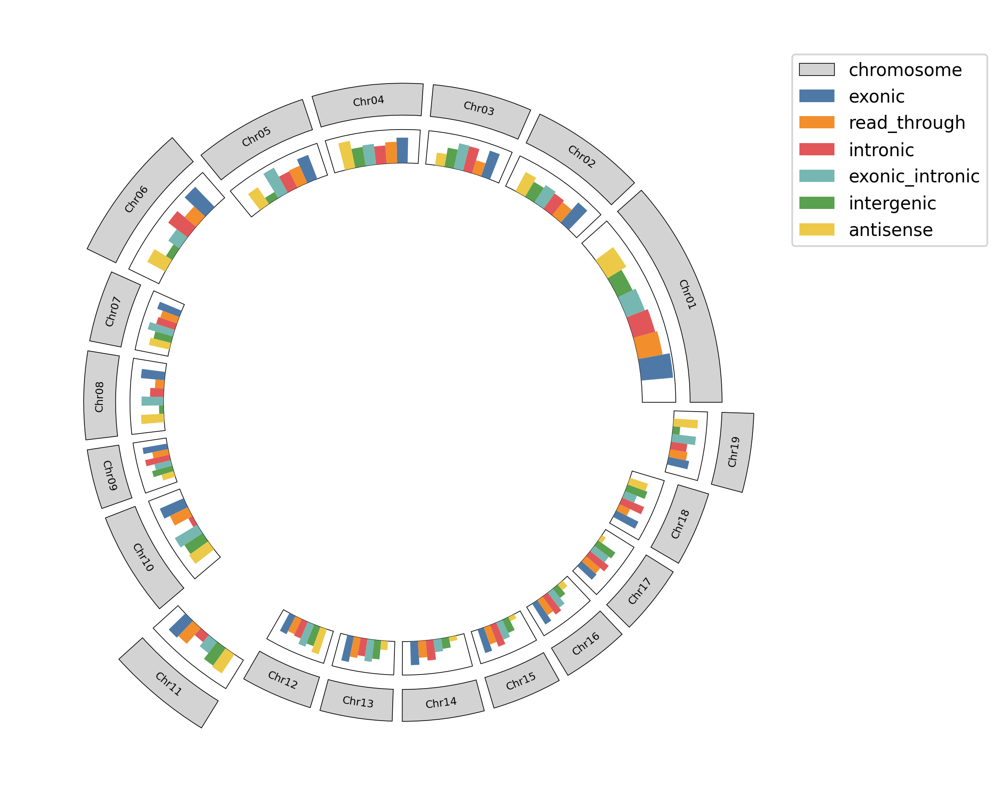
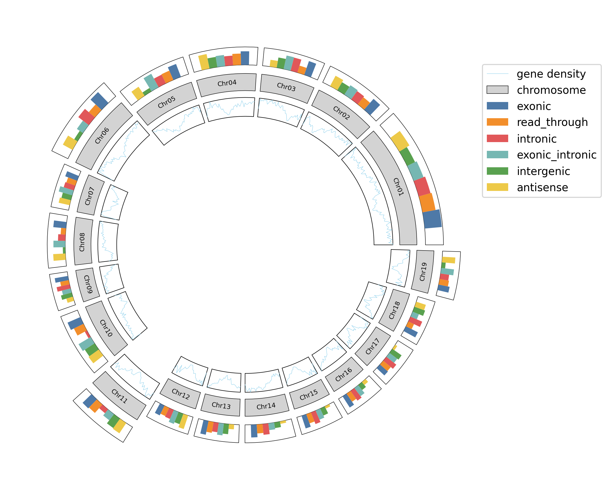
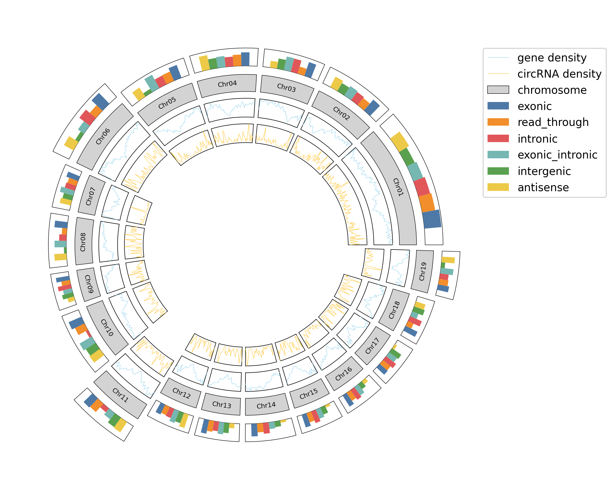

[](https://pypi.org/project/genome-circos/)
# GenomeCircos: Genome circos diagram python package

## Install
```shell
pip install genome-circos --upgrade
```

# Change logs
## v0.2.0
- New
  - New attributions of ChromosomeCircos:
    - spacing: Set the spacing between chromosomes to be one quarter (spacing=4) of the shortest chromosome.
  - New methods of ChromosomeCircos:
    - plot2: show feature density using heatmap.
    - save: Save the image.
- Modified
  - Null
- Deleted
  - Null

## Usage example
### 1. Show chromosome.
#### Place all the chromosomes on the same ring.
```python
from genome_circos import ChromosomeCircos

cc = ChromosomeCircos(
    chr_len_file='example/chr_len.txt',  # chromosome length file (ChrName\tChrLen\tEtc)
    spacing=4,  # set the spacing between chromosomes to be one quarter of the shortest chromosome
    font=None,  # use default font of matplotlib.rcParams['font.family']
    figsize=(10, 8),  # figure dimension (width, height) in inches
    dpi=300  # dots per inch
)

ax = cc.chr_bar(
    height=1,  # chromosome bar height
    bottom=10,  # chromosome bar bottom y-axis coordinate
    face_color='lightgrey',  # chromosome bar fill colr
    edge_color='black',  # chromosome bar border colr
    line_width=0.4,  # chromosome bar border width
    font_size=6  # chromosome name font size
)

ax.legend(loc=(0.999, 0.9))
cc.save('example/1.png')
```

#### List all available fonts on your system.
```python
import matplotlib.font_manager as fm

all_fonts = fm.findSystemFonts()
font_names = [f.name for f in fm.fontManager.ttflist]
unique_fonts = sorted(set(font_names))
for idx, font in enumerate(unique_fonts, 1):
    print(f"{idx}. {font}")
```
#### Make some chromosomes protrude outward.
```python
bottom = [9, 9, 9, 9, 9, 10, 9, 9, 9, 9, 11, 9, 9, 9, 9, 9, 9, 9, 10]

ax = cc.chr_bar(
    height=1,
    bottom=bottom,
    face_color='lightgrey',
    edge_color='black',
    line_width=0.4,
    font_size=6
)

ax.legend(loc=(0.999, 0.9))
cc.save('example/2.png')
```


### 2. Count the number of different features on each chromosome.
```python
cc.bar(
    axes=ax,  # axes object of matplotlib.axes.Axes.
    stat_file='example/stat.txt',  # feature statistics file (ChrName\tFeatureType\tCount\tColor)
    bottom=[i + 1.5 for i in bottom],  # bottom y-axis coordinate of statistic bar on each chromosome
    frame=True  # add borders to the bar charts on each chromosome
)

ax.legend(loc=(0.999, 0.7))
cc.save('example/3.png')
```

Or move the bar chart to the inner circle.
```python
cc.bar(
    axes=ax,
    stat_file='example/stat.txt',
    bottom=[i - 1.5 for i in bottom],
    frame=True
)

ax.legend(loc=(0.999, 0.7))
cc.save('example/4.png')
```


### 3. Show feature density on each chromosome.
#### Show gene density.
```python
cc.plot(
    gene_density_file='example/gene_density.txt',  # feature density file (ChrName\tStart\tEnd\tCount)
    axes=ax,
    bottom=[i - 1.5 for i in bottom],  # y-axis coordinate bottom of gene density chart for each chromosome
    color='#87CEEB',  # density curve color
    label='gene density',  # density curve label
    frame=True  # enable borders
)

ax.legend(loc=(0.999, 0.6))
cc.save('example/5.png')
```

#### Show circRNA density.
```python
cc.plot(
    gene_density_file='example/circ_density.txt',
    axes=ax,
    bottom=[i - 3 for i in bottom],
    color='#FFC125',
    label='circRNA density',
    frame=True
)

ax.legend(loc=(0.999, 0.6))
cc.save('example/6.png')
```


### 4. Link the two loci on the genome that interact with each other.
```python
cc.links(
    axes=ax,
    link_file='example/link.txt',  # associated site file (ChrName\tStart\tEnd\tChrName\tStart\tEnd\tColor\tLabel)
    bottom=[i - 3.1 for i in bottom],
    line_width=0.6,
    alpha=0.5
)

ax.legend(loc=(0.999, 0.6))
cc.save('example/7.png')
```


### 5. All steps.
```python
from genome_circos import ChromosomeCircos

cc = ChromosomeCircos(
    chr_len_file='example/chr_len.txt',
    spacing=4,
    font=None,  # use default font of matplotlib.rcParams['font.family']
    figsize=(10, 8),
    dpi=300
)

bottom = [10, 10, 10, 10, 10, 11, 10, 10, 10, 10, 12, 10, 10, 10, 10, 10, 10, 10, 11]

ax = cc.chr_bar(
    height=1,
    bottom=bottom,
    face_color='lightgrey',
    edge_color='black',
    line_width=0.4,
    font_size=6
)

cc.bar(
    axes=ax,
    stat_file='example/stat.txt',
    bottom=[i + 1.05 for i in bottom],
    frame=False  # disable borders
)

# show repeat sequence density using curve
cc.plot(
    gene_density_file='example/repeat_density.txt',
    axes=ax,
    bottom=[i - 3.6 for i in bottom],
    line_width=0.5,
    color='#87CEEB',
    label='repeat sequence density',
    frame=True  # enable borders
)

cc.links(
    axes=ax,
    link_file='example/link.txt',
    bottom=[i - 3.8 for i in bottom],
    line_width=0.8,
    alpha=0.5
)

# show gene density using heatmap
# note: plot2 must be placed at the very end
cc.plot2(
    gene_density_file='example/gene_density.txt',
    axes=ax,
    bottom=[i - 1 for i in bottom],
    height=0.5,  # heatmap height
    linewidths=1,  # gene density heatmap curve width for each chromosome
    cmap='rainbow',  # color map, see https://matplotlib.org/stable/gallery/color/colormap_reference.html
    label='gene density',
    n_min=0,  # the data value mapped to the bottom of the colormap (i.e. 0)
    n_max=80  # the data value mapped to the top of the colormap (i.e. 1).
)

# show circRNA density using heatmap
cc.plot2(
    gene_density_file='example/circ_density.txt',
    axes=ax,
    bottom=[i - 2 for i in bottom],
    height=0.5,
    linewidths=1,
    cmap='cool',
    label='circRNA density',
    n_min=0,
    n_max=3
)

ax.legend(loc=(0.999, 0.6))
cc.save('example/8.png')
```


**Tips: Use the "bottom" parameter of each plotting function to control the distance between each circle in the Circos graph.**

**More detail params see [example file](example).**