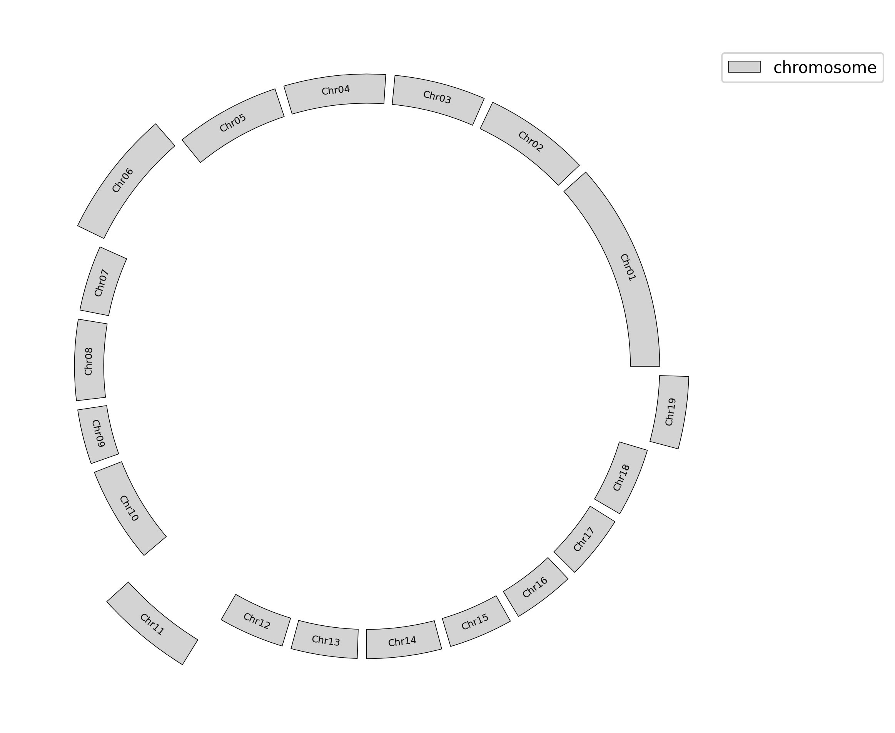
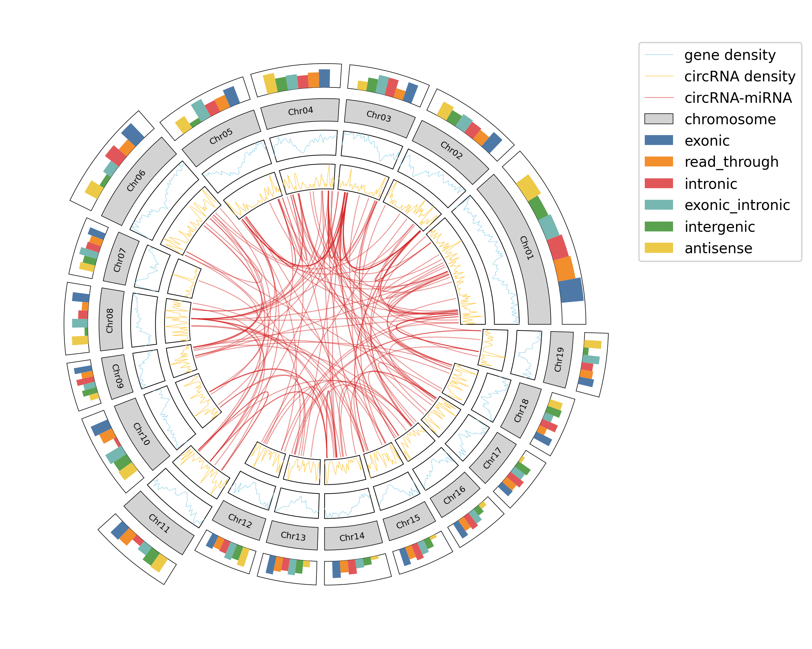
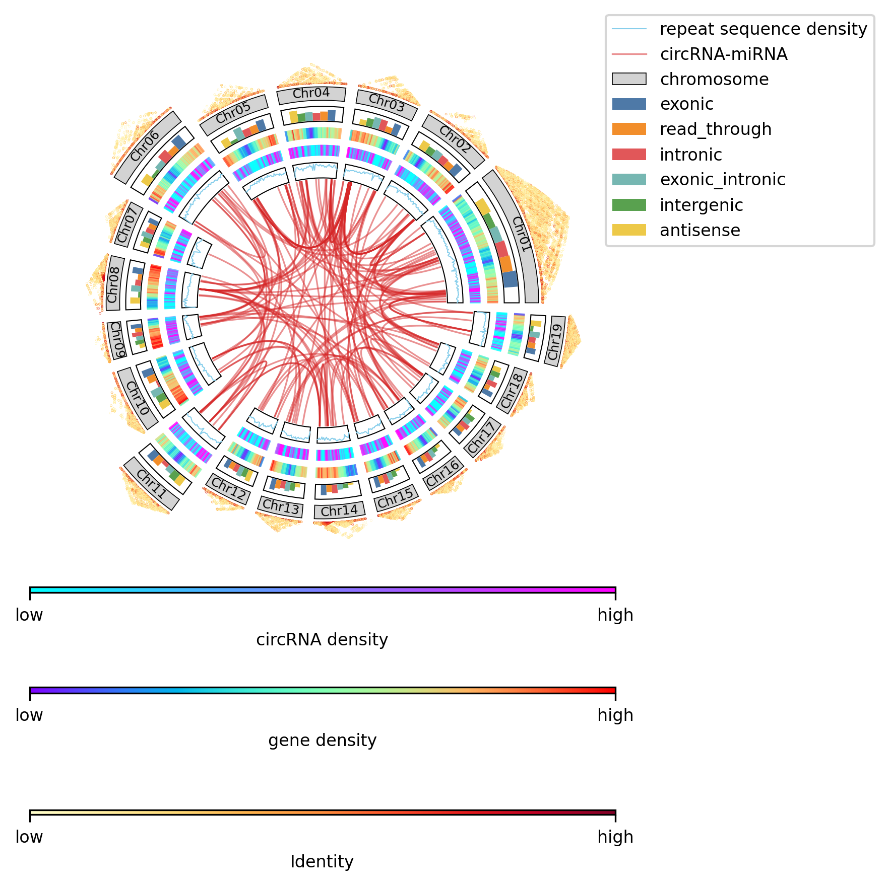

# GenomeCircos: Genome circos python package.

## Install
```shell
pip install genome-circos
```

## Usage example
### 1. Show chromosome.
#### Place all the chromosomes on the same ring.
```python
import matplotlib.pyplot as plt
from genome_circos import ChromosomeCircos

cc = ChromosomeCircos(
    chr_len_file='example/chr_len.txt',  # chromosome length file (ChrName\tChrLen\tEtc)
    font=None,  # use default font of matplotlib.rcParams['font.family']
    figsize=(10, 8),  # figure dimension (width, height) in inches
    dpi=300  # dots per inch
)

ax = cc.chr_bar(
    height=1,  # chromosome bar height
    bottom=10,  # chromosome bar bottom y-axis coordinate
    face_color='lightgrey',  # chromosome bar fill colr
    edge_color='black',  # chromosome bar border colr
    line_width=0.4,  # chromosome bar border width
    font_size=6  # chromosome name font size
)

plt.legend(loc=(0.999, 0.9))
plt.savefig('example/1.png', bbox_inches='tight')
```

#### Make some chromosomes protrude outward.
```python
bottom = [9, 9, 9, 9, 9, 10, 9, 9, 9, 9, 11, 9, 9, 9, 9, 9, 9, 9, 10]

ax = cc.chr_bar(
    height=1,
    bottom=bottom,
    face_color='lightgrey',
    edge_color='black',
    line_width=0.4,
    font_size=6
)

plt.legend(loc=(0.999, 0.9))
plt.savefig('example/2.png', bbox_inches='tight')
```


### 2. Count the number of different features on each chromosome.
```python
cc.bar(
    axes=ax,  # axes object of matplotlib.axes.Axes.
    stat_file='example/stat.txt',  # feature statistics file (ChrName\tFeatureType\tCount\tColor)
    bottom=[i + 1.5 for i in bottom],  # bottom y-axis coordinate of statistic bar on each chromosome
    frame=True  # add borders to the bar charts on each chromosome
)

plt.legend(loc=(0.999, 0.7))
plt.savefig('example/3.png', bbox_inches='tight')
```

Or move the bar chart to the inner circle.
```python
cc.bar(
    axes=ax,
    stat_file='example/stat.txt',
    bottom=[i - 1.5 for i in bottom],
    frame=True
)

plt.legend(loc=(0.999, 0.7))
plt.savefig('example/4.png', bbox_inches='tight')
```


### 3. Show feature density on each chromosome.
#### Show gene density.
```python
cc.plot(
    gene_density_file='example/gene_density.txt',  # feature density file (ChrName\tStart\tEnd\tCount)
    axes=ax,
    bottom=[i - 1.5 for i in bottom],  # y-axis coordinate bottom of gene density chart for each chromosome
    color='#87CEEB',  # density curve color
    label='gene density',  # density curve label
    frame=True  # enable borders
)

plt.legend(loc=(0.999, 0.6))
plt.savefig('example/5.png', bbox_inches='tight')
```

#### Show circRNA density.
```python
cc.plot(
    gene_density_file='example/circ_density.txt',
    axes=ax,
    bottom=[i - 3 for i in bottom],
    color='#FFC125',
    label='circRNA density',
    frame=True
)

plt.legend(loc=(0.999, 0.6))
plt.savefig('example/6.png', bbox_inches='tight')
```


### 4. Link the two loci on the genome that interact with each other.
```python
cc.links(
    axes=ax,
    link_file='example/link.txt',  # 
    bottom=[i - 3.1 for i in bottom],
    line_width=0.6,
    alpha=0.5
)

plt.legend(loc=(0.999, 0.6))
plt.savefig('example/7.png', bbox_inches='tight')
```


### 5. All steps.
```python
import matplotlib.pyplot as plt
from genome_circos import ChromosomeCircos

cc = ChromosomeCircos(
    chr_len_file='example/chr_len.txt',
    font=None,  # use default font of matplotlib.rcParams['font.family']
    figsize=(10, 8),
    dpi=300
)

bottom = [9, 9, 9, 9, 9, 10, 9, 9, 9, 9, 11, 9, 9, 9, 9, 9, 9, 9, 10]

ax = cc.chr_bar(
    height=1,
    bottom=bottom,
    face_color='lightgrey',
    edge_color='black',
    line_width=0.4,
    font_size=6
)

cc.bar(
    axes=ax,
    stat_file='example/stat.txt',
    bottom=[i + 1.05 for i in bottom],
    frame=False  # disable borders
)

cc.plot(
    gene_density_file='example/gene_density.txt',
    axes=ax,
    bottom=[i - 1.5 for i in bottom],
    color='#87CEEB',
    label='gene density',
    frame=True  # enable borders
)

cc.plot(
    gene_density_file='example/circ_density.txt',
    axes=ax,
    bottom=[i - 3 for i in bottom],
    color='#FFC125',
    label='circRNA density',
    frame=True  # enable borders
)

cc.links(
    axes=ax,
    link_file='example/link.txt',
    bottom=[i - 3.1 for i in bottom],
    line_width=0.6,
    alpha=0.5
)

plt.legend(loc=(0.999, 0.6))
plt.savefig('example/8.png', bbox_inches='tight')
```


**Tips: Use the "bottom" parameter of each plotting function to control the distance between each circle in the Circos graph.**

**More detail params see [example file](example).**