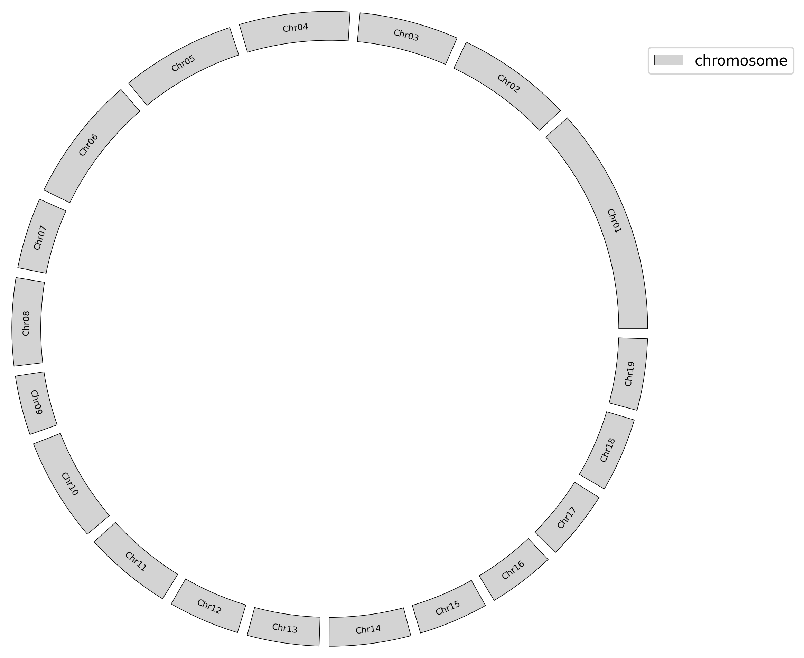
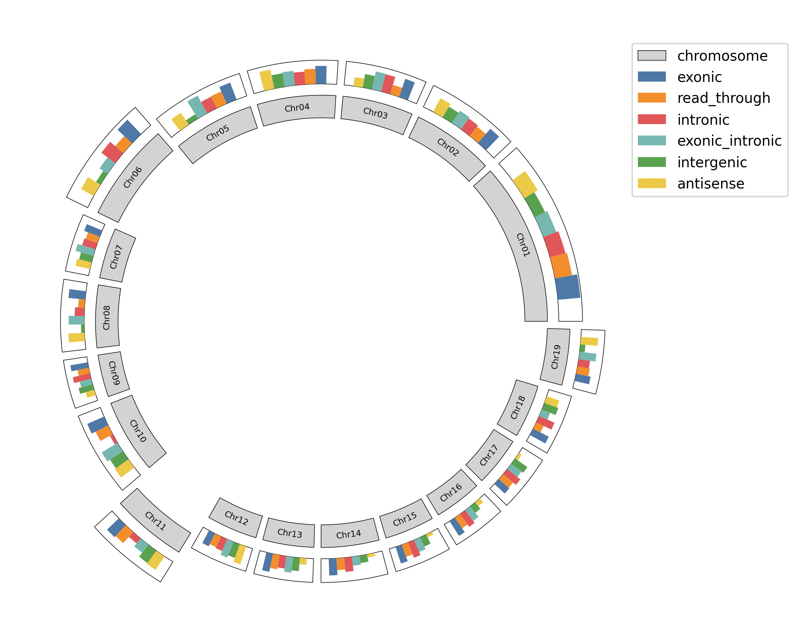

# GenomeCircos: Genome circos python package.

## Install
```shell
pip install genome-circos
```

## Usage example
### 1. Show chromosome.
#### Place all the chromosomes on the same ring.
```python
import matplotlib.pyplot as plt
from genome_circos import ChromosomeCircos

cc = ChromosomeCircos(chr_len_file='example/chr_len.txt')

ax = cc.chr_bar(
    height=1,
    bottom=10,
    face_color='lightgrey',
    edge_color='black',
    line_width=0.4,
    font_size=6,
    figure_size=(6.4, 4.8)
)

plt.legend(loc=(0.999, 0.3))
plt.show()
```

#### Make some chromosomes protrude outward.
```python
bottom = [9, 9, 9, 9, 9, 10, 9, 9, 9, 9, 11, 9, 9, 9, 9, 9, 9, 9, 10]

ax = cc.chr_bar(
    height=1,
    bottom=bottom,
    face_color='lightgrey',
    edge_color='black',
    line_width=0.4,
    font_size=6,
    figure_size=(6.4, 4.8)
)

plt.legend(loc=(0.999, 0.3))
plt.show()
```


### 2. Count the number of different features on each chromosome.
```python
cc.bar(
    axes=ax,
    stat_file='example/stat.txt',
    bottom=[i + 1.5 for i in bottom],
    frame=True
)

plt.legend(loc=(0.999, 0.8))
plt.show()
```

Or move the bar chart to the inner circle.
```python
cc.bar(
    axes=ax,
    stat_file='example/stat.txt',
    bottom=[i - 1.5 for i in bottom],
    frame=True
)

plt.legend(loc=(0.999, 0.7))
plt.show()
```


### 3. Show feature density on each chromosome.
#### Show gene density.
```python
cc.plot(
    gene_density_file='example/gene_density.txt',
    axes=ax,
    bottom=[i - 1.5 for i in bottom],
    color='#87CEEB',
    label='gene density'
)

plt.legend(loc=(0.999, 0.5))
plt.show()
```

#### Show circRNA density.
```python
cc.plot(
    gene_density_file='example/circ_density.txt',
    axes=ax,
    bottom=[i - 3 for i in bottom],
    color='#FFC125',
    label='circRNA density'
)

plt.legend(loc=(0.999, 0.5))
plt.show()
```


### 4. Link the two loci on the genome that interact with each other.
```python
cc.links(
    axes=ax,
    link_file='example/link.txt',
    bottom=[i - 3.1 for i in bottom],
    line_width=0.6,
    alpha=0.5
)

plt.legend(loc=(0.999, 0.2))
plt.show()
```


### 5. All steps.
```python
import matplotlib.pyplot as plt
from genome_circos import ChromosomeCircos

cc = ChromosomeCircos(chr_len_file='example/chr_len.txt')

bottom = [9, 9, 9, 9, 9, 10, 9, 9, 9, 9, 11, 9, 9, 9, 9, 9, 9, 9, 10]

ax = cc.chr_bar(
    height=1,
    bottom=bottom,
    face_color='lightgrey',
    edge_color='black',
    line_width=0.4,
    font_size=6,
    figure_size=(10, 8)
)

cc.bar(
    axes=ax,
    stat_file='example/stat.txt',
    bottom=[i + 1.5 for i in bottom],
    frame=True
)

cc.plot(
    gene_density_file='example/gene_density.txt',
    axes=ax,
    bottom=[i - 1.5 for i in bottom],
    color='#87CEEB',
    label='gene density'
)

cc.plot(
    gene_density_file='example/circ_density.txt',
    axes=ax,
    bottom=[i - 3 for i in bottom],
    color='#FFC125',
    label='circRNA density'
)

cc.links(
    axes=ax,
    link_file='example/link.txt',
    bottom=[i - 3.1 for i in bottom],
    line_width=0.6,
    alpha=0.5
)

plt.legend(loc=(0.999, 0.2))
plt.savefig('example/7.png', bbox_inches='tight')
plt.show()
```

**More detail params see [example file](example).**